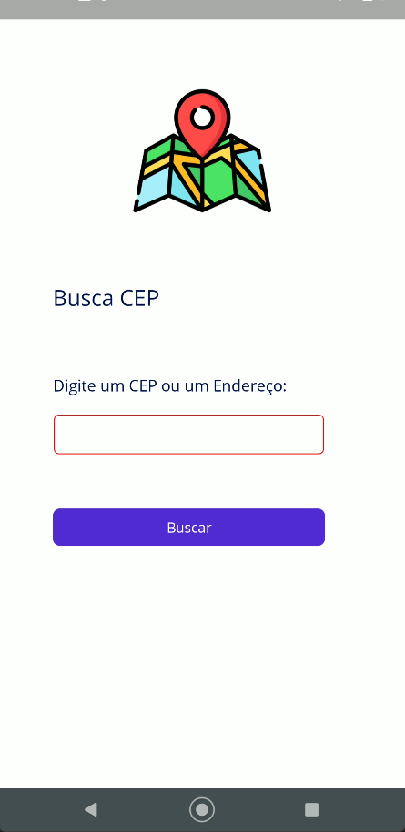
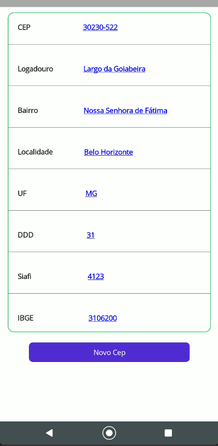

# Consulta CEP - Seu aplicativo .NET MAUI

Olá! Bem-vindo ao Consulta CEP, um aplicativo móvel desenvolvido com .NET MAUI. Este aplicativo foi criado com o objetivo de fornecer uma maneira rápida e eficiente de consultar CEPs.

## Recursos
Consulta rápida de CEP: Basta digitar o CEP desejado e obter informações detalhadas instantaneamente.

Interface amigável: O aplicativo possui uma interface intuitiva e fácil de usar, tornando a consulta de CEPs uma tarefa simples.

Desenvolvido com .NET MAUI: Utilizando a mais recente tecnologia da Microsoft, o .NET Multi-platform App UI (MAUI), este aplicativo oferece uma experiência suave e consistente em todas as plataformas.

## Como usar
Instale o aplicativo em seu dispositivo móvel.

Abra o aplicativo e você verá um campo para inserir o CEP.

Digite o CEP que deseja consultar e pressione ‘Enter’.

As informações do CEP serão exibidas na tela.

Esperamos que você aproveite este aplicativo tanto quanto nós gostamos de desenvolvê-lo. Se você tiver alguma dúvida ou sugestão, não hesite em nos contatar. Aproveite a consulta do seu CEP!

## Interfaces:

